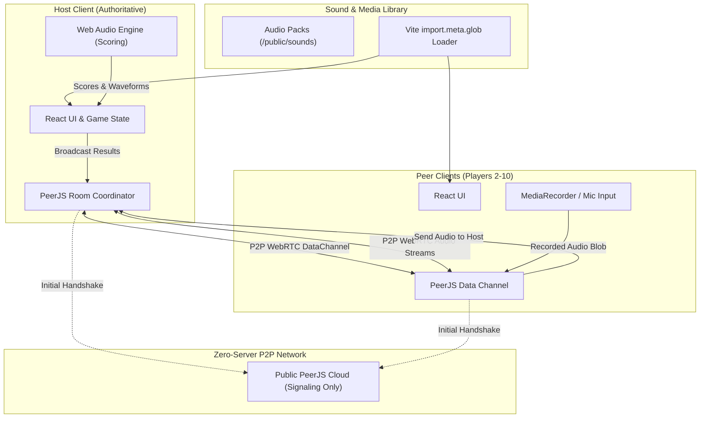

# 🎙️ ParrotParty

> **A multiplayer party voice-imitation game built purely for fun, laughs, and chaotic audio showdowns!**

[](https://shyammvm.github.io/ParrotParty/)
[](https://shyammvm.github.io/ParrotParty/)
[](https://vitejs.dev/)

🎮 **Play Online:** [https://shyammvm.github.io/ParrotParty/](https://shyammvm.github.io/ParrotParty/)

---

## ⚡ What is Parrot Party?

**Parrot Party** is a multiplayer voice imitation party game. Players gather in a room, listen to hilarious sound clips (iconic Malayalam movie dialogues, Japanese anime voice lines, meme sound effects, and more), and record their best voice impersonations.

The app uses an **in-browser audio analysis engine** to compare pitch, rhythm, energy, and timing against the original sound clip, ranking everyone on a chaotic live leaderboard with witty commentary and badges.

> [!NOTE]
> ### 🎨 Pure Vibe Coded Project
> This entire application is **vibe coded** — crafted iteratively with AI pair programming, zero traditional backend boilerplate, zero monthly cloud server bills, and optimized purely for maximum fun, smooth animations, and instant multiplayer connectivity.

---

## 🚀 Key Features

- 🌐 **Serverless P2P Multiplayer (Up to 10 players)**: Create or join rooms with a simple 4-character room code. No login, sign-up, or database required.
- 🗣️ **Built-in WebRTC Voice Chat**: Live voice chat mesh with mute/unmute, speaking indicators, and custom mic device selection.
- 🎵 **Preloaded Sound Packs**:
  - 🍿 **Malayalam Movies**: Classic comedy dialogues & iconic moments.
  - 🎌 **Japanese Anime**: Iconic catchphrases & viral lines.
  - 🤣 **Funny Sounds**: Viral laughs, cats, screams, and comedic SFX.
- 🧠 **Zero-Cloud Audio Comparison Engine**:
  - Uses the native browser **Web Audio API**.
  - Extracts pitch via autocorrelation, energy envelopes via RMS, and timing features.
  - Dynamic Time Warping (DTW) and cross-correlation similarity scoring — 100% offline, privacy-first, and zero latency.
- 📊 **Animated Reveal & Waveforms**: Compare user waveforms against the original sound wave side-by-side with synchronized audio playback.
- 🏆 **Dynamic Leaderboards**: Scores, ranks, hilarious custom titles, and final winner podium.

---

## 🏗️ Architecture Overview

The application runs **100% client-side** in the player's browser. It uses peer-to-peer WebRTC mesh connections for game state synchronization and voice chat, paired with the browser's native Web Audio API for processing audio.



### Component Breakdown

| Layer | Technology | Role |
|---|---|---|
| **Frontend Framework** | React 18 + Vite 5 | Reactive UI, phase transitions, waveform visualization |
| **Styling** | Vanilla CSS Tokens | Glassmorphism, animated cards, Fredoka & Nunito typography |
| **Networking** | PeerJS (WebRTC) | Zero-server peer-to-peer data channels for lobby and state sync |
| **Voice Chat** | WebRTC MediaStream | Real-time mesh voice chat between active players |
| **Audio Engine** | Web Audio API | Pitch extraction, RMS envelope, silence trimming, DTW matching |
| **Hosting & CI/CD** | GitHub Pages + Actions | Automated builds on push to `main` |

---

## 🕹️ Game Flow

1. **Lobby**: Players pick avatars, enter nicknames, and join the room via code or shared invite link.
2. **Prompt Selection**: Host picks a sound pack or rolls for a random audio prompt.
3. **Listen Phase**: Everyone listens to the reference sound clip simultaneously.
4. **Record Phase**: Players get a 3-second countdown to record their imitation into the microphone.
5. **Reveal Phase**: The host machine computes similarity scores, plays submissions back with animated waveforms, and reveals the funniest titles.
6. **Leaderboard**: Points are tallied on a live scoreboard across multiple rounds.

---

## 🛠️ Local Development

To run Parrot Party locally on your machine:

```bash
# 1. Clone the repository
git clone https://github.com/shyammvm/ParrotParty.git
cd ParrotParty

# 2. Install dependencies
npm install

# 3. Start local development server
npm run dev
```

Visit `http://localhost:5173` in your browser.

To build for production:
```bash
npm run build
npm run preview
```

---

## 📂 Adding Your Own Sounds

You can add custom sound packs without writing code:
1. Create a new folder inside `public/sounds/<Your Pack Name>/`
2. Drop `.mp3`, `.wav`, or `.ogg` audio files into it.
3. The app will automatically scan and create a playable pack!

---

## 📜 License

MIT License — free to share, modify, and vibe with!
